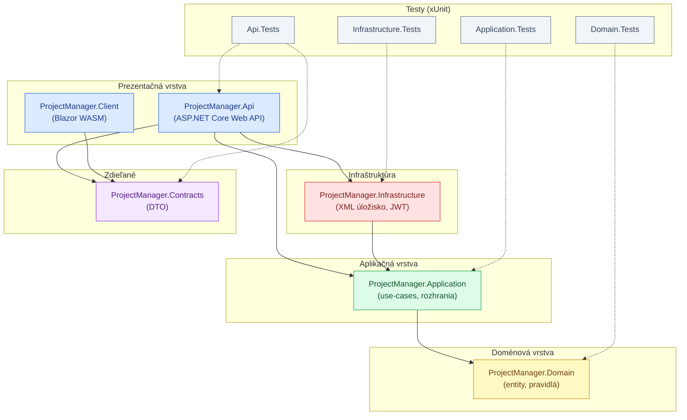
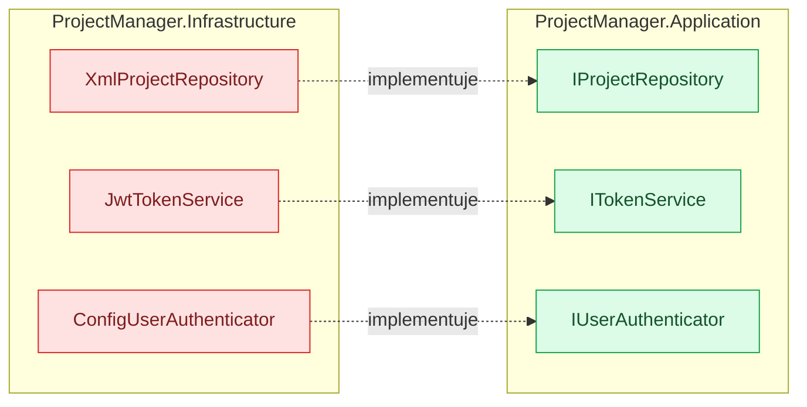
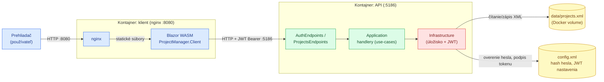

# Architektúra – diagramy

Vizuálny prehľad riešenia **Správa projektov**: vrstvy a závislosti medzi projektmi,
princíp dependency inversion a runtime tok pri behu (vrátane nasadenia cez Docker).
Diagramy sú v [Mermaid](https://mermaid.js.org/) — renderujú sa priamo na GitHube.

Podrobné odôvodnenie architektúry je v [design dokumente](2026-06-18-sprava-projektov-design.md).

## 1. Vrstvy a project referencie

Šípka `A --> B` znamená, že projekt `A` má `<ProjectReference>` na projekt `B` (t. j. `A`
závisí od `B`). Prerušované šípky testov (`-.->`) označujú, ktorý projekt daná testovacia
sada pokrýva.

**Poznámky:**

- **`Domain`** nemá žiadne odchádzajúce referencie — jadro je zámerne bezzávislostné
  (pravidlo Clean Architecture: závislosti smerujú dovnútra, k doméne).
- **`Contracts`** (zdieľané DTO) tiež nemá odchádzajúce referencie; používa ho `Api`
  (serializácia odpovedí) aj `Client` (deserializácia) na oboch stranách drôtu.
- **`Infrastructure`** závisí od `Application` (nie naopak) — implementuje jej rozhrania.
  Tento obrátený smer je detailne v diagrame č. 2.

## 2. Dependency inversion (rozhranie vs. implementácia)

`Application` definuje rozhrania, ktoré potrebuje, ale **nepozná** ich konkrétnu
implementáciu. Tú dodáva `Infrastructure`. Referenčná šípka teda ide
`Infrastructure --> Application`, no za behu tečú volania opačne (`Application` volá
rozhranie, DI za ním dosadí triedu z `Infrastructure`). Vďaka tomu je úložisko vymeniteľné
(XML → DB/REST/Cloud) bez zásahu do jadra.

Zapojenie prebieha v `Infrastructure/DependencyInjection.cs` (registrácia implementácií do DI).

## 3. Runtime a nasadenie

End-to-end tok od prehliadača po úložisko. Prerušovaná hranica označuje dva kontajnery
z `deploy/docker-compose.yml`. Klient (Blazor WASM) beží v prehliadači a volá API cez HTTP
s JWT `Bearer` tokenom.

**Poznámky:**

- Pri lokálnom behu bez Dockera platí ten istý tok — klient na `:5150`, API na `:5186`
  (viď [README](../README.md), sekcia Spustenie).
- `data/projects.xml` je v compose pripojený ako **volume**, takže dáta prežijú reštart
  kontajnera.
- Heslá a tokeny sa nikdy nelogujú; v `config.xml` je len PBKDF2 hash hesla, JWT podpisový
  kľúč je secret (user-secrets / env premenná).
